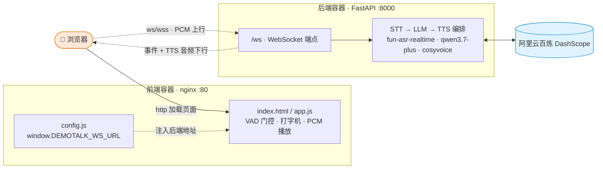

# DemoTalk · 实时低延迟语音助手（带视觉）

基于 Python 的实时语音对话助手，模型服务全部来自**阿里云百炼（DashScope）**：

| 能力 | 模型 | 接入 |
|---|---|---|
| 语音识别 (STT) | `fun-asr-realtime` | dashscope SDK，全双工 WebSocket |
| 大模型 (LLM) | `qwen3.7-plus` | OpenAI 兼容接口，SSE 流式（关闭思考） |
| 语音合成 (TTS) | `cosyvoice-v3-flash` | dashscope SDK，WebSocket 流式回调 |
| 视觉（多模态） | `qwen3.7-plus` | LLM 主动调用 `take_photo` 工具 → 前端拍照 → 多模态回传 |

- 浏览器前端：双列布局（左聊天 / 右摄像头取景器）+「暖夜控制台」暖色调科技风视觉；打字机流式对话输出、开始/结束对话按钮、调用本机麦克风、扬声器与摄像头。
- **前后端分离**：后端纯 WebSocket API（独立容器/进程），前端纯静态 nginx（独立容器），浏览器**直连**后端 `/ws`。可同时部署，也可只起前端或只起后端。
- 低延迟：STT 实时转写、LLM 流式产出、按句即时喂给 TTS、PCM 直传播放（首包约 350ms）。
- 视觉：对话需要"看"时（如「这是什么」「前面有什么」），LLM 主动调 `take_photo` 拍照，基于画面回答（qwen3.7-plus 多模态）。
- 支持打断（barge-in）：助手说话时你开口，立即停止播报并进入新一轮。
- 工具链：`uv` 管理环境与依赖。

## 架构



> **部署拓扑**：前端容器只托管静态资源（不反代 WS）；浏览器**直连**后端容器 `/ws`（跨域）。生产 `wss` 由后端前置 nginx/Caddy 终止 TLS。两容器互相独立，可单独启动。

<details><summary>内部数据流（ASCII）</summary>

```
浏览器 ──http──▶ 前端容器 (nginx, 纯静态 + config.js 注入 DEMOTALK_WS_URL)
   │
   └──ws/wss──▶ 后端容器 (FastAPI :8000 /ws)
                  ├─ STT(fun-asr-realtime, SDK线程) ──partial──► 实时字幕
                  │     └─final─► LLM(qwen3.7-plus, enable_thinking=False)
                  │                      ├─delta─► 打字机文本 + 按句喂 TTS
                  │                      │                └─PCM─► 浏览器播放
                  │                      └─tool_calls(take_photo)─► WS 下发 take_photo
                  │                                                     └─前端抓帧 → photo 回传 → 多模态回 LLM
                  └─ barge-in：句末到达且当前在播报 → 取消 TTS + 停止播放
```
</details>

线程模型：STT/TTS 回调运行在 dashscope SDK 自有线程，经 `asyncio.run_coroutine_threadsafe` 桥接到事件循环；LLM 用 `AsyncOpenAI` 纯异步。状态机：`listening → thinking → speaking → listening`。

## 前置条件

- **uv**（[安装](https://docs.astral.sh/uv/)）：本机已自带则忽略。
- **Python 3.10–3.13**：uv 会按 `.python-version` 自动下载 3.12。
- **百炼 API Key**：在 [百炼控制台](https://bailian.console.aliyun.com/?tab=model#/api-key) 获取（本项目默认走**北京**地域）。
- 浏览器需支持 `AudioWorklet`（Chrome / Edge / Firefox 新版均可）；首次需允许**麦克风与摄像头**权限（视觉功能需要摄像头）。

## 快速开始（本地开发）

### 后端

```bash
cd backend
uv sync                                    # uv 自动建 .venv（Windows 若报锁文件，加 UV_LINK_MODE=copy）
uv run python -m uvicorn app.main:app --host 127.0.0.1 --port 8000
```

### 前端

纯静态，任选一种方式 serve（让浏览器能加载页面）：

```bash
# 方式 A：前端容器（自动按 DEMOTALK_BACKEND_URL 生成 config.js 指向后端）
docker compose up frontend

# 方式 B：本地静态服务，手写 config.js 指向后端
cd frontend
echo 'window.DEMOTALK_WS_URL = "ws://localhost:8000/ws";' > config.js
python -m http.server 8080
```

浏览器打开 <http://localhost:8080>，点「**开始对话**」，允许**麦克风与摄像头**后即可开口交谈。

> 自检（无头往返，TTS 合成语音喂回 STT 验证全链路）：先启动后端，另开终端 `cd backend && uv run python scripts/selftest.py`，看到 `===== 全部自检通过 =====` 即代表 STT→LLM→TTS 真实打通。

## Docker 部署（前后端分离，推荐）

前后端各自独立镜像/容器，可一起部署，也可单独起。

**前置**：装好 [Docker](https://docs.docker.com/get-docker/)（自带 Docker Compose v2）。

```bash
# 1. 配置 API Key
cp .env.example .env
#   编辑 .env，填入 DASHSCOPE_API_KEY=sk-xxxx

# 2. 构建并后台启动（首次或改了代码加 --build）
docker compose up --build -d

# 3. 查看状态与日志（backend STATUS 变 healthy 即就绪）
docker compose ps
docker compose logs -f
```

浏览器打开 <http://localhost:8080>（前端，`FRONTEND_PORT` 默认 8080）；后端 WS 在 `ws://localhost:8000`（`BACKEND_PORT` 默认 8000）。

**分离启动**（两服务互相独立，无 `depends_on`）：

```bash
docker compose up backend      # 仅后端：:8000，可被任意 WS 客户端 / selftest 直连
docker compose up frontend     # 仅前端：:8080，页面可加载；后端不在时 WS 连不上 → 优雅降级
```

**停止**：`docker compose down`。**改完 `.env` 生效**：`docker compose restart`。

说明：

- `DEMOTALK_BACKEND_URL`（默认 `ws://localhost:8000`）是**浏览器视角**的后端 WS 地址，前端容器据此生成 `config.js`。本地直连用 localhost；**局域网/服务器部署需改成浏览器实际可达地址**（如 `ws://192.168.1.10:8000` 或 `wss://api.example.com`）。
- **生产 wss**：后端容器内跑明文 `ws`；`wss`（WS over TLS）由后端前置 nginx/Caddy 终止 TLS 后反代到后端容器，`.env` 设 `DEMOTALK_BACKEND_URL=wss://...`。最小示例见下方「生产 wss 反代」。
- 端口：后端宿主 `BACKEND_PORT`（容器内恒 8000），前端宿主 `FRONTEND_PORT`（容器内恒 80）。
- 首次需联网：构建拉基础镜像与依赖；运行时前端 VAD 库走 jsdelivr CDN，之后浏览器缓存。
- 后端镜像内置默认 `mcp.json`（SSE 类型）。自定义 MCP 取消 `docker-compose.yml` 里 `backend.volumes` 注释用宿主 `backend/mcp.json` 覆盖；stdio 类 MCP（如 `npx`）需自行在后端镜像补运行时。
- 多阶段构建、非 root 运行；后端镜像仅打包 `app/`、前端镜像仅打包 `static/`，彻底分离。

### 生产 wss 反代（后端前置 nginx 示例）

```nginx
server {
    listen 443 ssl;
    server_name api.example.com;
    ssl_certificate     /path/fullchain.pem;
    ssl_certificate_key /path/privkey.pem;

    location /ws {
        proxy_pass http://<后端容器>:8000/ws;   # 后端容器名/地址
        proxy_http_version 1.1;
        proxy_set_header Upgrade $http_upgrade;
        proxy_set_header Connection "upgrade";
        proxy_read_timeout 3600s;
    }
}
```
然后 `.env` 设 `DEMOTALK_BACKEND_URL=wss://api.example.com`，`docker compose up frontend` 重新生成 `config.js`。

## 配置项（.env）

| 变量 | 默认 | 说明 |
|---|---|---|
| `DASHSCOPE_API_KEY` | （必填） | 百炼 API Key |
| `STT_MODEL` | `fun-asr-realtime` | 实时语音识别模型 |
| `LLM_MODEL` | `qwen3.7-plus` | 大模型（混合思考，默认强制关闭思考） |
| `TTS_MODEL` | `cosyvoice-v3-flash` | TTS 模型 |
| `TTS_VOICE` | `longanyang` | 音色（龙安洋）。系统音色还有 `longxiaochun`/`longwan`/`longcheng` 等 |
| `TTS_SAMPLE_RATE` | `24000` | TTS 输出采样率（24000/22050/48000/16000） |
| `LLM_SYSTEM_PROMPT` | 简洁中文助手 | 系统提示词 |
| `LLM_TEMPERATURE` | `0.7` | 采样温度 |
| `MAX_SENTENCE_SILENCE` | `800` | STT 句尾静音毫秒，越小越快判定说完（200–6000） |
| `ENABLE_BARGE_IN` | `true` | 是否允许打断 |
| `VAD_SENSITIVITY` | `70` | 前端语音门控灵敏度 0-100，越大越易触发（背景噪声多则调低） |
| `ENABLE_ECHO_DETECT` | `true` | 回声检测总开关（外放自循环防护） |
| `ECHO_SIMILARITY_THRESHOLD` | `0.6` | 回声相似度阈值 0-1，越低越激进判回声 |
| `ECHO_HANGOVER_MS` | `1200` | speaking 结束后仍检测的窗口(毫秒) |
| `ENABLE_IDLE_TIMEOUT` | `true` | 空闲超时总开关（listening 期间无输入自动播报提示并断开） |
| `IDLE_TIMEOUT` | `15` | 空闲多少秒触发断开 |
| `IDLE_PROMPT` | （固定文案） | 超时播报的提示语，直接喂 TTS |
| `ENABLE_VISION` | `true` | 是否启用视觉（take_photo 工具） |
| `PHOTO_MAX_SIZE` | `640` | 拍照最长边像素 |
| `PHOTO_QUALITY` | `0.8` | JPEG 质量 |
| `TAKE_PHOTO_TIMEOUT` | `5` | 拍照超时(秒) |
| `MAX_TOOL_CALLS_PER_TURN` | `3` | 每轮工具调用上限 |
| `ENABLE_END_BY_VOICE` | `true` | 是否启用「语义结束」（说再见等由 LLM 调 `end_conversation` 结束） |
| `ENABLE_MCP` | `true` | 是否启用 MCP（外部工具服务器） |
| `MCP_CONFIG_FILE` | `mcp.json` | MCP 配置文件路径（mcpServers 格式） |
| `ENABLE_LATENCY_METRIC` | `true` | 每轮首包下发端到端延迟埋点（total/tts_first/llm_ttft ms） |
| `ENABLE_COMMA_SPLIT` | `true` | 句子切分含逗号/冒号，更早喂 TTS（false 退回仅句末标点） |
| `SENTENCE_SPLIT_MAX_LEN` | `12` | 无标点时累积到此字数也强制喂 TTS（0=禁用） |
| `ENABLE_VAD_TURN_END` | `true` | 前端 VAD `speech_end` 提前触发回合结束（替代等 STT final 800ms） |
| `ENABLE_LOCAL_BARGE_IN` | `true` | 前端 VAD 即时本地打断 + 上行 cancel（false 回退纯服务端） |
| `HOST` / `PORT` | `127.0.0.1` / `8000` | 本地直接跑后端时的监听（docker 容器内恒 8000） |
| `BACKEND_PORT` | `8000` | docker：后端宿主端口（浏览器 WS 直连） |
| `FRONTEND_PORT` | `8080` | docker：前端宿主端口（浏览器打开） |
| `DEMOTALK_BACKEND_URL` | `ws://localhost:8000` | 浏览器视角后端 WS 地址（生产 `wss://...`） |

### 运行时开关（前端）

`ENABLE_BARGE_IN` / `ENABLE_MCP` / `ENABLE_END_BY_VOICE` / `ENABLE_IDLE_TIMEOUT` 四项除 `.env` 默认值外，还可在浏览器右上角齿轮设置面板中**运行时切换**，立即生效（中断下一句句末生效；MCP / 语义结束下一轮 LLM 调用生效；空闲超时下一次看门狗复查 ≤1s 生效）。切换状态用 localStorage 记住，优先级：`localStorage 上次值` > `.env 默认`。MCP 仅屏蔽当前会话的工具暴露，不卸载连接。

### 语音门控（VAD）

前端接入 Silero VAD（`@ricky0123/vad-web`）：只有检测到**人声**的麦克风帧才上传给 ASR，静音与非人声噪声（键盘、咳嗽、电视音乐、风声等）被丢弃，显著降低背景噪声对对话的干扰。Silero ONNX 模型与 onnxruntime WASM 本地托管于前端 `static/vad/`（路径 `frontend/static/vad/`）；库 JS 走 jsdelivr CDN（**首次加载需联网**，之后浏览器缓存）。库初始化失败时自动回退到无门控直传。

> **首次加载延迟**：首次「开始对话」需下载并编译 ort WASM（~11MB），冷启动约 30-60 秒；浏览器缓存后，后续会话几乎无感。

灵敏度滑块（设置面板，0-100，默认取 `VAD_SENSITIVITY`）经 `vad.setOptions()` 实时生效，localStorage 记住上次选择。

**能力边界：** VAD 能区分「人声 vs 非人声噪声」，但**无法区分说话人来源**——环境里的**其他人声**（旁人说话、电视/视频里的人声）仍可能被识别并上传。这是开放式麦克风的固有限制；如需彻底屏蔽环境人声，需引入按住说话（Push-to-Talk）或唤醒词（当前范围外）。

### 回声检测（外放自循环防护）

外放使用时，助手 TTS 的合成人声会被麦克风收回去（浏览器自带 AEC 对 TTS 外放效果有限），前端 VAD 又分不清「是助手在说还是用户在说」，导致回声被转写、助手对着自己的回声「自言自语」自循环。

后端做**文本级回声检测**：`_on_final` 下发前，若处于 speaking 期间或说完后 1.2s 内，且 STT 转写与最近一轮 TTS 文本相似度 ≥ 阈值，判为回声丢弃——不发用户消息、不触发 barge-in、不开新一轮。真用户说的话内容不同，正常通过，**语音 barge-in 完整保留**。前端另在 speaking 期间隐藏 partial 字幕，消除回声转写的闪烁。

- `ENABLE_ECHO_DETECT=false` 可关闭；`ECHO_SIMILARITY_THRESHOLD` 调相似度松紧；`ECHO_HANGOVER_MS` 调说完后的检测窗口。
- **能力边界**：文本级方案，对 ASR 把回声严重错识成无关文字的极端情况会漏判（概率低，且有浏览器 AEC + 前端 VAD 前置挡一部分）。**根治回声的最优解是戴耳机**（扬声器声音物理上进不了麦克风）。

### 低延迟优化（端到端首响）

「用户说完 → 听到助手第一个字」的端到端延迟，参考 [HuggingFace speech-to-speech](https://github.com/huggingface/speech-to-speech) 做了如下优化（每项独立 `.env` 开关，可回滚）：

- **延迟埋点**（`ENABLE_LATENCY_METRIC`）：每轮首包下发 `{total_ms, tts_first_ms, llm_ttft_ms}`，浏览器控制台与状态栏显示，用于量化每次调整的收益。
- **句子切分细化**（`ENABLE_COMMA_SPLIT` / `SENTENCE_SPLIT_MAX_LEN`）：LLM 输出按逗号/冒号等子句（或攒够定长）即喂 TTS，不必等整句句号，让 TTS 首包在时间轴提前。
- **VAD 驱动 turn-end**（`ENABLE_VAD_TURN_END`）：复用前端 Silero VAD 的 `onSpeechEnd`，用户停说后 ~150-250ms 即触发回合结束并开始响应，**不再干等 STT 句末静音 final（~800ms）**——这是首响路径最大的一刀。后端用缓存的最新 STT `partial` 作为用户输入；STT final 作为兜底（裸 WS / 丢包时仍可用），二者先到先触发、后到丢弃，避免重复。
- **本地 barge-in**（`ENABLE_LOCAL_BARGE_IN`）：助手播报时用户一开口，前端 VAD 即刻停播并上行 `cancel`，不必等服务端 `cancel_playback` 回路（借鉴 s2s 由 VAD 帧级事件驱动打断）。

> **关于回声**：本地 barge-in 与 VAD turn-end 在外放时可能把 TTS 回声误判为用户开口（浏览器 AEC 对外放效果有限）。后端文本级回声检测仍兜底（回声 final 被丢弃、**不会自循环**，至多提前停播一次）。**根治仍是戴耳机**。
>
> 调参建议：延迟仍偏高可调小 `MAX_SENTENCE_SILENCE`（如 500）、上调 `VAD_SENSITIVITY`；误打断多则下调 `VAD_SENSITIVITY`。

### 关于 TTS 模型（重要）

- `cosyvoice-v3-flash`（默认）：支持**系统音色**，开箱即出声，首包延迟约 350ms。
- 若切换到 `cosyvoice-v3.5-flash`：**仅北京区**可用、且**没有任何系统音色**，必须先在百炼做「声音复刻」或「声音设计」拿到一个 `voice id`，填到 `TTS_VOICE`，否则合成会失败。

## 项目结构

```
DemoTalk/
├── backend/                # 后端（FastAPI 纯 WebSocket API）
│   ├── app/
│   │   ├── main.py         # FastAPI：/ws + /healthz（不托管静态前端）
│   │   ├── config.py       # 环境变量配置
│   │   ├── session.py      # 会话编排：状态机 + 三服务联动 + barge-in + tool 循环
│   │   ├── stt.py / llm.py / tts.py   # fun-asr-realtime / qwen3.7-plus / cosyvoice
│   │   ├── tools/          # take_photo / end_conversation + registry
│   │   └── mcp/            # MCP client（config/client/adapter/manager）
│   ├── tests/              # pytest 单测
│   ├── scripts/selftest.py # 真实全链路自检
│   ├── pyproject.toml / uv.lock / mcp.json / .python-version
│   ├── Dockerfile          # 后端镜像（uv 多阶段，仅打包 app/）
│   └── .dockerignore
├── frontend/               # 前端（nginx 纯静态）
│   ├── index.html          # 入口页面（/ 返回它）
│   ├── static/
│   │   ├── style.css
│   │   ├── app.js          # 麦克风/VAD 门控/打字机/播放/WS 逻辑（读 DEMOTALK_WS_URL）
│   │   └── vad/            # Silero VAD 本地资源（onnx + ort wasm + worklet bundle）
│   ├── nginx.conf          # 纯静态托管（不反代 WS；浏览器直连后端）
│   ├── entrypoint.sh       # 按 DEMOTALK_BACKEND_URL 生成 config.js
│   ├── Dockerfile          # 前端镜像（nginx:alpine + static/）
│   └── .dockerignore
├── docker-compose.yml      # 两服务（backend + frontend，互相独立，无 depends_on）
├── .env.example            # 根级配置（后端变量 + 部署端口 + DEMOTALK_BACKEND_URL）
└── README.md
```

## 视觉能力（摄像头）

`qwen3.7-plus` 是多模态模型。当对话需要"看"时（如用户问「这是什么」「前面有什么」），LLM 会**主动调用** `take_photo` 工具：

1. LLM 发起 `take_photo` → 后端经 WS 通知前端
2. 前端抓取当前摄像头画面（JPEG，最长边默认 640px）→ 回传
3. 后端把图像作为多模态 tool 结果回 LLM → LLM 基于画面回答 → TTS 播报

前置：浏览器与系统均需授权摄像头。点「开始对话」时会同时申请麦克风 + 摄像头，画面显示在右侧取景器主区域（开始后浮现四角取景框 +「取景中」徽标，拍照时画面闪光）。`ENABLE_VISION=false` 可关闭视觉能力（回退纯语音）。

每轮对话最多调用 3 次工具（`MAX_TOOL_CALLS_PER_TURN`），防止循环。

> 手动验证视觉：启动服务后浏览器打开页面，授权麦克风+摄像头，对镜头展示一个物体并问「我前面这个东西是什么」，应看到"正在拍照…"提示、画面闪光、随后助手基于画面回答并语音播报。

## MCP 接入（外部工具）

DemoTalk 可作为 MCP client 连接外部 MCP server，把 server 的工具暴露给 LLM。MCP 工具与视觉 `take_photo` 共存，复用同一 tool-calling 循环。

配置文件 `backend/mcp.json`（标准 `mcpServers` 格式），支持 SSE 与 stdio：

```json
{
  "mcpServers": {
    "howtocook-mcp": { "type": "sse", "url": "https://..." },
    "some-local":    { "type": "stdio", "command": "npx", "args": ["-y", "x"], "env": {} }
  }
}
```

启动时进程级加载所有 server（`McpManager.load_all`），连接失败的 server 跳过（不影响其他与主服务）。`ENABLE_MCP=false` 可关闭。

## 常见问题

- **听不到声音**：确认 `TTS_MODEL`+`TTS_VOICE` 匹配（v3.5-flash 必须配自创音色 id）；确认浏览器未静音、页面已获音频播放权限（点过「开始对话」）。
- **麦克风无权限**：浏览器地址栏点击锁形图标，允许麦克风，刷新页面。
- **`未配置 DASHSCOPE_API_KEY`**：`.env` 未创建或 Key 为空。
- **报 401/403**：Key 与地域不匹配（北京用北京 key，国际站用对应 key）。
- **延迟偏高**：调小 `MAX_SENTENCE_SILENCE`（如 600）；LLM 换 `qwen-plus`/`qwen-flash`（更快、默认关思考）。

## 协议说明（WebSocket）

- 客户端 → 服务端：
  - 文本：`{"type":"stop"}` 结束会话；`{"type":"cancel"}` 主动打断；`{"type":"photo","call_id":...,"data":...}` 拍照回传（含 call_id 与 base64 JPEG）；`{"type":"photo_error","call_id":...,"message":...}` 拍照失败。
  - 二进制：麦克风 16kHz/16bit/单声道 PCM。
- 服务端 → 客户端：
  - `tts_format` / `state` / `partial`（实时转写）/ `user_final` / `delta`（助手增量）/ `tts_start` / `tts_end` / `cancel_playback` / `error`；视觉相关：`take_photo`（要求拍照，含 `call_id`）/ `tool_running`（工具执行中，含 `tool` 名）/ `vision_config`（下发拍照参数）。
  另有 `conversation_end`（语义结束：助手告别语播完后下发，前端据此在播放队列空时断连回初始态）。
  - 二进制：TTS 的 PCM（按 `tts_format` 解码）。
